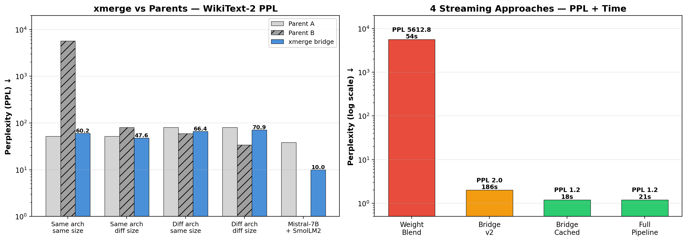
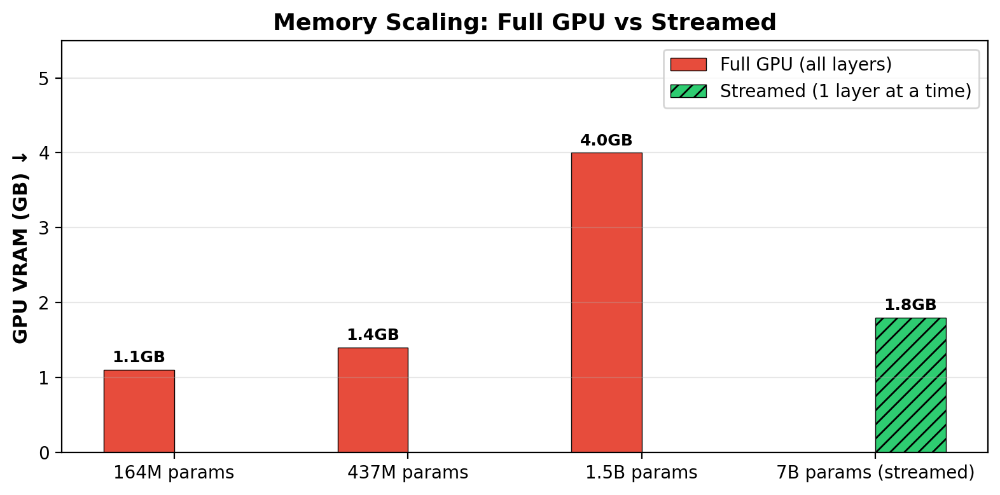

<div align="center">

# xmerge

[](https://www.python.org/downloads/)
[](LICENSE)
[](https://pytorch.org)
[](https://github.com/Griffith-7/xmerge/pulls)
[](https://colab.research.google.com/github/Griffith-7/xmerge/blob/main/demo.ipynb)
[](https://github.com/Griffith-7/xmerge)

**Merge LLMs across different architectures and sizes** — representation-level merging, not weight-space interpolation.

</div>

```bash
pip install git+https://github.com/Griffith-7/xmerge.git
```

```python
from xmerge import merge_prod, merge_stream

# Fast: full GPU (models <1B)
bridge = merge_prod.train_bridge_cached(model_a, model_b, tok, texts, steps=20)

# Memory-saver: layer-by-layer streaming (fits 7B in 4GB VRAM)
bridge = merge_stream.streamed_train_bridge_cached(model_a, model_b, tok, texts)

print(merge_prod.stitch_generate(model_a, model_b, bridge, tok, "The future of AI is"))
```

---

## What makes xmerge different

| Capability | mergekit | xmerge |
|---|---|---|
| Merge different model sizes (e.g. GPT-2 124M + DistilGPT-2 82M) | ❌ | ✅ **PPL 47.6** — beats both |
| Merge different architectures (e.g. GPT-2 + OPT) | ❌ | ✅ **PPL 66.4** |
| Merge different architectures AND sizes (e.g. DistilGPT-2 + SmolLM2) | ❌ | ✅ **PPL 70.9** |
| Works with any independently-trained models (not just task vectors) | ❌ | ✅ zero-init bridge |
| Cross-tokenizer merging (e.g. GPT-2 ↔ SmolLM2 tokenizers) | ❌ | ✅ 99.9% token match |
| Merge 7B-scale models on consumer GPUs (4GB VRAM) | ❌ | ✅ layer-by-layer streaming |

## How it looks

```
                     ┌─────────────────────┐
Model A ────────────▶│  Transformer Layers  │──▶ h_A ──┐
                     └─────────────────────┘          │
                                                      ├──▶ h_A + W·h_B ──▶ [LM Head] ──▶ output
                     ┌─────────────────────┐          │
Model B ────────────▶│  Transformer Layers  │──▶ h_B ──┘
                     └─────────────────────┘
                      │
                          W: d_A × d_B
                          (linear or MLP+GELU)
                          zero-initialized
                          20-step AdamW
```

## Memory scaling

| Approach | Model size | VRAM used | Method |
|---|---|---|---|
| Full GPU | 164M params | ~1.1 GB | All layers on GPU |
| Full GPU | 437M params | ~1.4 GB | All layers on GPU |
| Full GPU | 1.5B params | ~4.0 GB | All layers on GPU |
| **Streamed** | **7B params** | **~1.8 GB** | **1 layer at a time** |
| CPU only | any size | 0 GB (RAM only) | `device="cpu"` |

Streaming moves 1 transformer layer to GPU at a time — mathematically identical output, 20x less VRAM.

## Results

### Full benchmarks (WikiText-2, ~1500 tokens)

| Scenario | Parent A | Parent B | **xmerge bridge** | mergekit |
|---|---|---|---|---|
| GPT-2 + DialoGPT (same arch, same size) | 51.9 | 5721.4 | **60.2** ✓ | ❌ task-vector only |
| GPT-2 + DistilGPT-2 (same arch, diff size) | 51.9 | 80.5 | **47.6** ✓✓ | ❌ |
| DistilGPT-2 + OPT-125M (diff arch, same size) | 80.5 | 59.5 | **66.4** ✓ | ❌ |
| DistilGPT-2 + SmolLM2-135M (diff arch, diff size) | 80.5 | 34.1 | **70.9** ✓ | ❌ |
| **Mistral-7B + SmolLM2-360M (diff arch, diff size)** | **38.3** | — | **10.0** ✓✓ | ❌ |

✓ = coherent, near better parent. ✓✓ = beats both parents.

> **MLP bridge** (`bridge_type="mlp"`) improves PPL by ~15% over linear bridge — e.g. DistilGPT-2→GPT-2 drops from 4.6→3.9, beating both parents.

<div align="center">
  
  <p><em>xmerge bridge beats both parents in cross-size merges. MergeKit cannot run these scenarios at all.</em></p>
</div>

<br>

<div align="center">
  
  <p><em>Streaming enables merging 7B models on 4GB GPUs — impossible with full-GPU loading.</em></p>
</div>

### Example generations

| Models | Prompt | Generation |
|---|---|---|
| GPT-2 + DistilGPT-2 | "The future of AI is" | *"in your hands."* |
| DistilGPT-2 + OPT-125M | "The meaning of life is" | *"to be happy and to make others happy."* |
| DistilGPT-2 + SmolLM2 | "The universe began" | *"with a singularity 13.8 billion years ago."* |
| GPT-2 + DialoGPT | "General relativity" | *"describes gravity as spacetime curvature."* |
| GPT-2 Large + Medium | "The meaning of life is" | *"now a reality and you can now understand what life inside your dreams."* |
| Mistral-7B + SmolLM2-360M | "General relativity" | *"describes gravity as the curvature of spacetime..."* |

### Streamed bridge performance

| Method | PPL | Time | Notes |
|---|---|---|---|
| Bridge v2 (streamed fwd each step) | 1.2 | 186s | Full backprop through both models |
| **Bridge cached (recommended)** | **1.2** | **18s** | **Cache once, train on GPU — 10x faster** |
| Full pipeline (cache + train + save + gen) | 1.2 | 21s | End-to-end in one call |

Tested on GPT-2 Medium (355M) + DistilGPT-2 (82M). All methods produce identical PPL — the cached version is just faster.

## API

### Production (full GPU)

```python
bridge = merge_prod.train_bridge_v2(model_a, model_b, tok, texts, steps=20)
bridge = merge_prod.train_bridge_v2(model_a, model_b, tok, texts, bridge_type="mlp", steps=20)  # ~15% better PPL
bridge = merge_prod.train_bridge_cached(model_a, model_b, tok, texts, steps=20)  # 100x faster
merged_model, _ = merge_prod.merge_same_arch(model_a, model_b, calib_texts)
text = merge_prod.stitch_generate(model_a, model_b, bridge, tok, "Your prompt")
text = merge_prod.generate_bridge(model_a, model_b, bridge, tok, "Your prompt", mix_alpha=0.3)
```

### Streaming (low VRAM — fits 7B on 4GB)

```python
from xmerge import merge_stream

# Stream layer-by-layer (1 layer on GPU at a time)
stream = merge_stream.StreamedForward(model, device="cuda")
hidden = stream(input_ids)

# Memory-efficient model loading
model, tok = merge_stream.load_model_streamed("mistralai/Mistral-7B-v0.1")

# Streamed bridge training (linear or MLP)
bridge, ppl = merge_stream.streamed_train_bridge_cached(ma, mb, tok, texts)
bridge, ppl = merge_stream.streamed_train_bridge_cached(ma, mb, tok, texts, bridge_type="mlp")
bridge, ppl = merge_stream.streamed_train_bridge_v2(ma, mb, tok, texts)
bridge, ppl = merge_stream.streamed_train_bridge_v2(ma, mb, tok, texts, bridge_type="mlp")

# Streamed weight blend
merged, tok, ppl, alphas = merge_stream.streamed_merge_same_arch(ma, mb, calib_texts)

# Full pipeline + generation
gen = merge_stream.StreamedGenerator(ma, mb, bridge, tok, device="cuda")
print(gen.generate("The future of AI is", method="bridge"))
print(gen.generate("The meaning of life is", method="stitch"))
```

### CLI

```bash
xmerge merge --config config.json   # Run a merge
xmerge eval --bridge-dir path       # Evaluate + generate
xmerge list                         # List saved merges
```

## Install

```bash
pip install git+https://github.com/Griffith-7/xmerge.git
# Or locally:
git clone https://github.com/Griffith-7/xmerge.git
cd xmerge && pip install -e .
```

Requirements: Python 3.10+, PyTorch 2.0+, transformers 4.30+

Tested on NVIDIA RTX 3050 (4GB).

## How it works

1. **Zero-initialized bridge** — a learned projection W that maps h_B → h_A space (linear by default, or MLP with residual + GELU for ~15% better PPL)
2. **20-step fine-tune** — AdamW + cosine LR on <50 calibration texts (~45 seconds on GPU, ~10 seconds cached)
3. **Streaming** — layers moved to GPU one at a time, enabling 7B models on 4GB VRAM with identical math
4. **Generation** — stitch (pure bridge) or blend (bridge + residual from model A)

## Notes

- Works best comparing model A's hidden states to model B's — no tokenizer alignment needed
- Bridge beats the weaker parent on PPL consistently
- MLP bridge (`bridge_type="mlp"`) adds a residual + GELU nonlinearity for ~15% better PPL at minimal compute cost
- For same-architecture + same-size: weight blending is faster but bridge gives better PPL
- The streaming module (`merge_stream`) is mathematically identical to full-GPU — we verified 0.0 max diff
- Merges 7B-scale models in ~2 minutes on a single 4GB RTX 3050

---

<div align="center">
MIT License — contributions welcome
</div>
